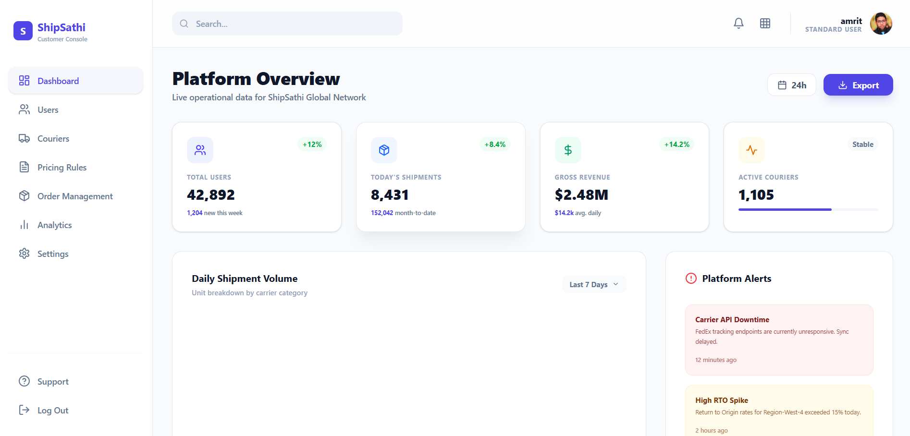
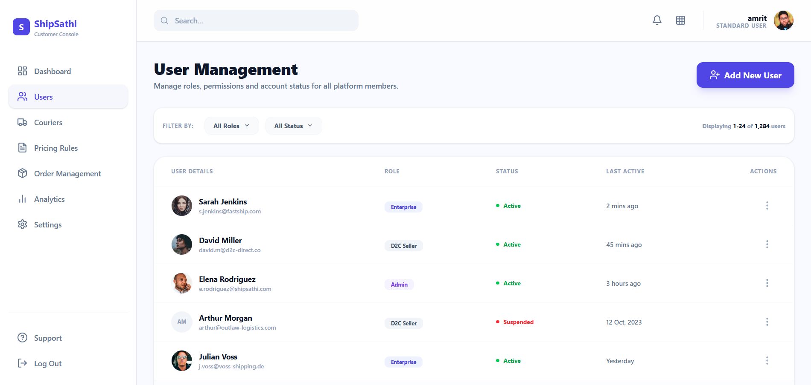
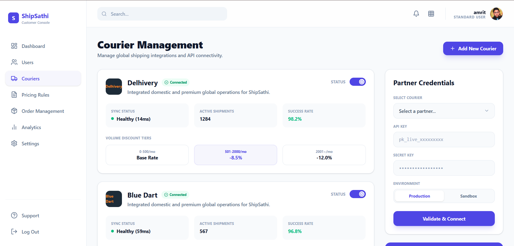

# ShipSathi - Courier Rate Aggregator & Shipping Intelligence Platform

## 🔗 Important Links
* **Figma Link:** [Figma Design](https://www.figma.com/design/V4dFQRdvATMqSQMHiPK6qd/Untitled?node-id=305-8&t=PQorFTSV0mRWlbkF-1)
* **Live Deployed Project Link:** [https://ship-sathi-scct.vercel.app/](https://ship-sathi-scct.vercel.app/)
* **Postman Documentation Link:** [documentation](https://documenter.getpostman.com/view/50840965/2sBXqKofPG)
* **Backend Deployed Link:** [https://shipsathi-db42.onrender.com/](https://shipsathi-db42.onrender.com/)
* **YouTube Demo Link:** [Add your YouTube video link here]

---

## 🚀 Problem Statement
E-commerce sellers, D2C brands, and small-to-medium logistics teams face significant inefficiencies in selecting the most cost-effective and reliable courier service for each shipment.

Currently, businesses rely on multiple courier partners (typically 5–10 providers such as Delhivery, Blue Dart, DTDC, etc.), each offering different pricing structures, delivery timelines, and service quality. However, there is no unified platform that provides real-time, standardized comparison across these courier services.

### Key Challenges:
1. **Time-Consuming Manual Process:** Sellers spend significant time comparing courier rates for each shipment.
2. **Complex Pricing Structures:** Multiple variables (zone, weight, volumetric weight, surcharges) make accurate calculation difficult.
3. **Lack of Real-Time Aggregation:** No centralized system to fetch and compare live courier rates.
4. **Suboptimal Decision-Making:** Sellers often choose non-optimal couriers, leading to higher shipping costs or delays.
5. **High Operational Costs:** Inefficient courier selection results in increased logistics expenses.
6. **Poor Scalability:** Manual workflows do not scale with increasing order volumes.
7. **Limited Data Insights:** Sellers lack visibility into courier performance, cost trends, and optimization opportunities.

---

## ✨ Solution
**ShipSathi** is a "Courier Rate Aggregator & Shipping Intelligence Platform" that automates courier selection and provides real-time rate comparison.

### Core Features:
- **Real-Time Rate Comparison:** Input pickup location, delivery location, weight, and dimensions to fetch live rates from multiple APIs.
- **Automated Courier Recommendation (AI-Based):** Suggests the best courier based on lowest cost, fastest delivery, or highest success rate.
- **Volumetric Weight & Pricing Engine:** Automatically calculates actual vs. volumetric weight and applies correct pricing logic.
- **Bulk Shipment Processing:** Upload CSVs for large-scale operations and auto-assign optimal couriers.
- **Cost Analytics Dashboard:** Track monthly spend, cost trends, and savings achieved.
- **Courier Performance Tracking:** Monitor delivery success rates, average delivery time, and RTO percentages.
- **Smart Rule Engine:** Define custom rules (e.g., "Use cheapest courier under ₹200").
- **API Integration Layer:** Normalized pricing formats across multiple courier partners.
- **Centralized Shipment Management:** Create, track, and manage shipments in one dashboard.
- **Cost Optimization Engine:** Suggest better strategies based on historical data.

---

## 🛠 Tech Stack

### Frontend
- **Framework:** React.js (Vite)
- **Styling:** Vanilla CSS
- **State Management:** Context API
- **Icons:** Lucide React
- **Animations:** Framer Motion

### Backend
- **Runtime:** Node.js
- **Framework:** Express.js
- **Database:** MongoDB
- **Authentication:** JSON Web Tokens (JWT) & Google OAuth 2.0 (Google Identity Services)

---

## 📂 Project Folder Structure

```text
ShipSathi/
├── backend/
│   ├── src/
│   │   ├── config/           # DB configuration
│   │   ├── controllers/      # Route controllers (Auth, Google Login, Orders)
│   │   ├── models/           # Mongoose schemas (User, Shipment)
│   │   ├── routes/           # Express API endpoints
│   │   └── server.js         # Entry point for backend
│   ├── .env.example
│   └── package.json
├── frontend/
│   ├── src/
│   │   ├── api/              # API hooks/functions
│   │   ├── components/       # Reusable components (MetaSEO, Navbar, Footer, Sidebar)
│   │   ├── config/           # App constants
│   │   ├── context/          # State management (AuthContext)
│   │   ├── pages/            # View components (Landing, Login, Dashboard, etc.)
│   │   ├── App.jsx           # Main router shell
│   │   └── main.jsx          # App entry point
│   ├── public/
│   │   ├── robots.txt        # Crawler directives
│   │   └── sitemap.xml       # Search engine map
│   ├── .env.example
│   └── package.json
└── README.md
```

---

## 📸 Project Screenshots / Images





---

## 🎯 Target Users
- E-commerce sellers
- D2C brands
- Logistics managers
- Warehouse operators
